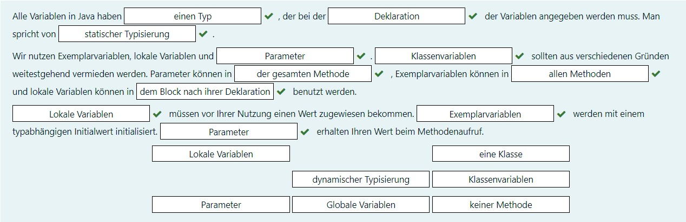

## ACHTUNG! Die Reihenfolge der Multiple-Choice-Aufgabe ist zufällig! ##

* [Teil-1](#Teil-1)
* [Teil-2](#Teil-2)
* [Teil 3](#Teil-3)

___

# Teil 1

## Frage 1 ##

Lückentext:



## Frage 2 ##

Welche der folgenden Anweisungsfolgen enthalten korrekte Schleifenkonstrukte in Java?

Wählen Sie eine oder mehrere Antworten:

- [x] ```int i=5;`while (i > 0) { System.out.println("Countdown:␣"+i); i=i-1;}```
- [x] ```int i, j; for (i = 1, j = 10; i <= 10; i++, j--) { System.out.println(i+"␣"+j); }```
- [x] ```int i = 0; do { System.out.println("Jetzt␣zum␣"+i+".Mal!␣"); i=i+1; } while (i <= 10);```
- [x] ```for (;;);```
- [ ] ```for i in range(1,100) { sum = sum + i; } System.out.println(sum);```
- [ ] ```while (int i>0) { i=i-1;}```
- [ ] ```int number=10; int sum= 0; repeat { sum = sum + number; number = number - 2; } until number == 0```

## Frage 3 ###

Geben Sie alle zweistelligen Vielfachen von 3 aus. Machen Sie nach jeder Zahl einen Zeilenumbruch.

```java
public class Main() {
    public static void main() {
        // Beginn der Lösung
        for (int i = 10; i <= 99; i++) {
            if (i % 3 == 0) {
                System.out.println(i);
            }
        }
        // Ende der Lösung
    }
}
```

## Frage 4 ##

Verwenden Sie ...

 ```java
 public class Main() {
    // Beginn der Lösung
    public void printStars(int number) {
        for (int i = 0; i < number; i++) {
            System.out.print("*");
        }
    }

    public void printTriangle(int number) {
        for (int i = 1; i <= number; i++) {
            for (int j = 0; j < i; j++) {
                System.out.print("*");
            }
            System.out.println();
        }
    }

    public void printStrings(int number, char zeichen) {
        for (int i = 0; i < number; i++) {
            System.out.print(zeichen);
        }
    }

    public void printDiamond(int number) {
        for (int lineIndex = 0; lineIndex < number; lineIndex++) {
            printStrings(number - lineIndex, ' ');
            printStrings(lineIndex * 2 + 1, '*');
            System.out.println();
        }
        for (int lineIndex = 0; lineIndex <= number; lineIndex++) {
            printStrings(lineIndex, ' ');
            printStrings(2 * (number - lineIndex) + 1, '*');
            System.out.println();
        }
    }
    // Ende der Lösung
}
 ```

---

# Teil 2 #

## Frage 1 ##

Monatsnamen mit R...

```java
public class Month {
    private final int month;

    public Month(int m) {
        month = m;
    }

    public boolean isRMonth() {
        // für die Monate September bis April soll true zurück gegeben werden.
        int normalisedMonth = month;
        if (normalisedMonth < 0) {
            while (normalisedMonth <= 0) {
                normalisedMonth += 12;
            }
        }
        if (normalisedMonth > 12) {
            while (normalisedMonth > 12) {
                normalisedMonth -= 12;
            }
        }
        return normalisedMonth <= 4 || normalisedMonth >= 9;
    }
}
```

## Frage 2 ##

Schreiben Sie eine Methode ...

```java
public class Main() {
    // Beginn der Lösung
    public int crossTotal(int n) {
        int sum = 0;
        while (n > 0) {
            sum += n % 10;
            n = n / 10;
        }
        return sum;
    }
    // Ende der Lösung
}
```

## Frage 3 ##

Screiben Sie eine Methode, ```int repeatedCrossTotal(int n)```...

```java
public class Main() {
    // Beginn der Lösung
    public int crossTotal(int n) {
        int sum = 0;
        while (n > 0) {
            sum += n % 10;
            n = n / 10;
        }
        return sum;
    }

    public int repeatedCrossTotal(int n) {
        while (n >= 10) {
            n = crossTotal(n);
        }
        return n;
    }
    // Ende der Lösung
}
```

## Frage 4 ##

```java
public class PrimeTester {
    public void divisors(int n) {
        System.out.print("Teiler von " + n + " sind");
        for (int i = 1; i <= n; i++) {
            if (n % i == 0) {
                if (i == 1) {
                    System.out.print(" " + i);
                } else {
                    System.out.print(", " + i);
                }
            }
        }
        System.out.println();
    }

    public void properDivisors(int n) {
        System.out.print("Echte Teiler von " + n + " sind");
        boolean first = true;
        //while(
        for (int i = 2; i < n; i++) {
            if (n % i == 0 && i != n) {
                if (first) {
                    System.out.print(" " + i);
                    first = false;
                } else {
                    System.out.print(", " + i);
                }
            }
        }
        System.out.println();
    }

    public boolean isPrime(int n) {
        if (n <= 1) {
            return false;
        }
        for (int i = 2; i < n; i++) {
            if (n % i == 0) {
                return false;
            }
        }
        return true;
    }
}
```

___

# Teil 3 #

## Frage 1 ##

Schreiben Sie eine Deklaration für eine lokale Array-Variable available, die auf ein Array von boolean-Werten verweisen
kann. Vergessen sie nicht das Semikolon am Ende der Deklaration:

```
boolean[] available;
```

Korrigieren sie die folgende fehlerhafte Deklaration/Initialisierung eines Arrays, das 5000 boolean-Werte aufnehmen
soll. Denken Sie wieder an das Semikolon am Ende der Anweisung.

```
boolean[5000] occupied;
```

Antwort:

```
boolean[] occupied = new boolean[5000];
```

## Frage 2 ##

Initialisieren Sie das Array ...

```java
public class Main() {
    public void main() {
        String[] spruch = {"Ich", "finde", "Java", "Spitze"};
        System.out.println(spruch[0]);
        System.out.println(spruch[1]);
        System.out.println(spruch[2]);
        System.out.println(spruch[3]);
    }
}
```

## Frage 3 ##

Gegeben ist ein Array ``ìnt[] numbers`` ...

```java
public class Main() {
    // Beginn der Lösung
    public void printNumbers(int[] numbers) {
        for (int i = 0; i < numbers.length; i++) {
            System.out.println(numbers[i]);
        }
    }
    // Ende der Lösung
}
```

## Frage 4 ##

Schreiben Sie eine Methode ```ìnt totalLength(String[] words)```...

```java
public class Main() {
    // Beginn der Lösung
    public static int totalLength(String[] words) {
        int total = 0;
        for (int i = 0; i < words.length; i++) {
            if (words[i] != null) {
                total += words[i].length();
            }
        }
        return total;
    }
    //Ende der Lösung
}
```

## Frage 5 ##

Die Prüfziffer ...

```java
public class Main() {
    // Beginn der Lösung
    public int luhn(int[] digits) {
        int sum = 0;
        for (int i = 0; i < digits.length; i++) {
            if (i % 2 == 0) {
                int doubled = digits[i] * 2;
                if (doubled > 9) {
                    doubled -= 9;
                }
                sum += doubled;
            } else {
                sum += digits[i];
            }
        }
        return sum % 10 == 0 ? 0 : 10 - (sum % 10);
    }
    // Ende der Lösung
}
```

## Frage 6 ##

Sieb des Eratosthenes...

```java
public class Main() {
    // Beginn der Lösung
    public boolean[] sieve(int n) {
        boolean[] numbers = new boolean[n - 1];
        for (int i = 2; i < numbers.length; i++) {
            if (!numbers[i - 2]) {
                for (int j = i * i; j < n; j += i) {
                    numbers[j - 2] = true;
                }
            }
        }
        numbers[numbers.length - 1] = true;
        return numbers;
    }
    // Ende der Lösung
}
```

## Frage 7 ##

Schreiben Sie eine Methode ```ìnt[][] chessBoard()```...

```java
public class Main() {
    // Beginn der Lösung
    public int[][] chessBoard() {
        int[][] board = new int[8][8];
        for (int i = 0; i < 8; i++) {
            for (int j = 0; j < 8; j++) {
                if ((i + j) % 2 == 1)
                    board[i][j] = 1;
            }
        }
        return board;
    }
    // Ende der Lösung
}
```

## Frage 8 ##

Pascal'sches Dreieck...

```java
public class Main() {
    // Beginn der Lösung
    public int[][] bino(int rows) {
        int[][] table = new int[rows][];
        for (int i = 0; i < rows; i++) {
            table[i] = new int[i + 1];
            table[i][0] = 1;
        }
        for (int row = 1; row < rows; row++) {
            for (int col = 1; col <= row; col++) {
                int elem = 0;
                if (col < row) { //< da <= auf undefinierte Zahlen zugreifen würde
                    elem = table[row - 1][col];
                }
                table[row][col] = table[row - 1][col - 1] + elem;
            }
        }
        return table;
    }
    // Ende der Lösung
}
```