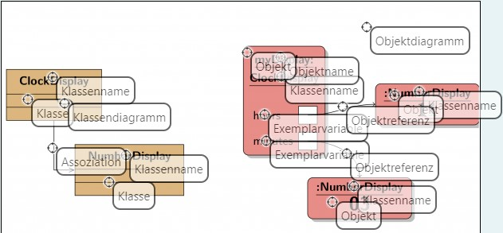

## ACHTUNG! Die Reihenfolge der Multiple-Choice-Aufgabe ist zufällig! ##
___
## Frage 1 ##
Sichtbarkeit und Methodenaufru


|                 | dieselbe Klasse | andere Klasse |
|-----------------|-----------------|---------------|
| interner Aufruf | private         | unmöglich     |
| externer Aufruf | private         | public        |


## Frage 2 ##
Klassen und Objektdiagramm



## Frage 3 ##
Lückentext

```Abstraktion``` ist der Übergang von der Betrachtung einzelner individueller Objekte zu Klassen von Objekten mit gemeinsamen Eigenschaften.

```Modularisierung``` ist das Zerlegen eines Problems in mehrere Teilprobleme.

## Frage 4 ##
Daltons ...

- [x] Joe
- [ ] Keins von dem
- [ ] Averll

## Frage 5 ##

In dieser Aufgabe..

```java
public class ClockDisplay {
    private final NumberDisplay hours;
    private final NumberDisplay minutes;
    private String displayString;

    public ClockDisplay() {
        hours = new NumberDisplay(24, null);
        minutes = new NumberDisplay(60, hours);
        updateDisplay();
    }

    public ClockDisplay(int hour, int minute) {
        hours = new NumberDisplay(24, null);
        minutes = new NumberDisplay(60, hours);
        setTime(hour, minute);
    }

    public void timeTick() {
        minutes.increment();
        updateDisplay();
    }

    public void setTime(int hour, int minute) {
        hours.setValue(hour);
        minutes.setValue(minute);
        updateDisplay();
    }

    public String getTime() {
        return displayString;
    }

    private void updateDisplay() {
        displayString = hours.getDisplayValue() + ":" +
                minutes.getDisplayValue();
    }
}

public class NumberDisplay {
    private final int limit;
    private int value;
    private final NumberDisplay parent;

    public NumberDisplay(int rollOverLimit, NumberDisplay parent) {
        limit = rollOverLimit;
        value = 0;
        this.parent = parent;
    }

    public NumberDisplay(int rollOverLimit) {
        this(rollOverLimit, null);
    }

    public int getValue() {
        return value;
    }

    public String getDisplayValue() {
        if (value < 10) {
            return "0" + value;
        } else {
            return "" + value;
        }
    }

    public void setValue(int replacementValue) {
        if ((replacementValue >= 0) && (replacementValue < limit)) {
            value = replacementValue;
        }
    }

    public void increment() {
        if (value + 1 >= limit && parent != null) {
            value = (value + 1) % limit;
            parent.increment();
        } else {
            value = (value + 1) % limit;
        }
    }
}
```